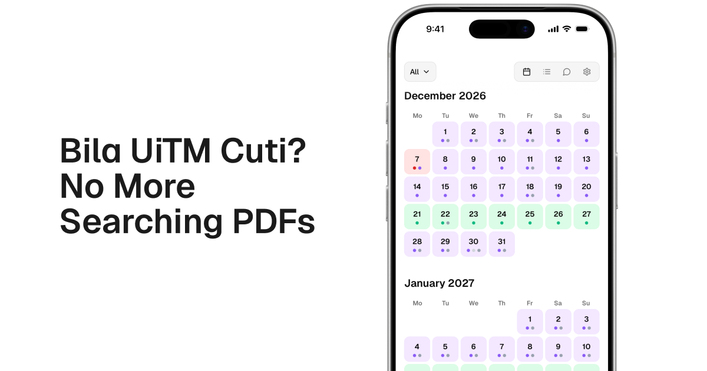

# Bila UiTM Cuti

Academic calendar for UiTM students. **Live:** [bilauitmcuti.com](https://bilauitmcuti.com)

## Summary

**Bila UiTM Cuti** is a web app that puts UiTM academic calendar dates in one place — semesters, lecture weeks, exams, breaks, and related holidays — so students do not have to dig through multiple PDFs on mobile. It is unofficial and not affiliated with UiTM.

The product centers on a calendar (grid and list) for Foundation through PhD, Group A and Group B, with program filters, regional date variants (Kedah, Kelantan, Terengganu), and optional countdowns. An AI chat answers date and general UiTM questions in English or Malay. The site is installable as a PWA, supports light/dark theme, and includes feedback plus a link to internship discovery.

Calendar data comes from the Bila UiTM Cuti API (`api.bilauitmcuti.com`), served to the browser through same-origin routes. The app runs on Next.js and Cloudflare Pages with Workers AI for chat.

## Features

| Area | Highlights |
|------|------------|
| **Calendar** | Grid and list views; Foundation through PhD; Group A/B; regional dates (Kedah, Kelantan, Terengganu); filters and countdown |
| **AI chat** | Ask about dates or general UiTM info (English or Malay); streaming replies; tool-calling agent in production |
| **PWA** | Installable via `/download`, offline-friendly service worker, light/dark theme |
| **Feedback** | [Feedback](/feedback) form; optional ratings and chat thumbs |
| **Internship** | Footer link to [Find My Internship](/internship) for opportunities across Malaysia |

## Why this exists

PDFs are painful when you are on mobile and trying to plan your semester.

- PDFs are hard to read on phones
- Students often download several PDFs per semester
- There is no single, clear place for academic schedules
- Dates get shared ad hoc via WhatsApp or Telegram
- Exam and break countdowns usually mean manual math

## Contributing

This repo is public for transparency; direction and merges are maintainer-led. See [CONTRIBUTING.md](CONTRIBUTING.md).

## License

Licensed under the [MIT License](LICENSE).
